# UX Design Specification: JobPilot

**Author:** bala
**Date:** 2026-01-25

---

## Executive Summary

### Project Vision

JobPilot transforms job search from active work to supervised delegation. Instead of users manually searching, tailoring, and applying, they set preferences and let specialized AI agents handle the heavy lifting 24/7. The user's role shifts to:

1. Set preferences and goals (onboarding)
2. Review daily briefings (morning ritual)
3. Approve high-stakes actions (quick decisions)
4. Show up to interviews (the fun part)
5. Accept offers (the goal)

**Core Positioning**: "Your AI Career Agent that works 24/7"

### Target Users

**Primary Segments:**

| Segment | Mode | Characteristics | Core Need |
|---------|------|-----------------|-----------|
| Active Job Seekers | Sprint | Unemployed/urgently seeking, high engagement | Volume + quality applications without burnout |
| Employed Professionals | Cruise | Passively open, time-constrained | "Always ready" state without active effort |
| International Workers | H1B | Visa-dependent, need sponsor data | Reliable sponsor intelligence + premium support |

**User Context:**
- **Tech Savviness**: Intermediate to advanced (expects modern, AI-native UX)
- **Devices**: Desktop for application work, mobile for briefings and approvals
- **Usage Pattern**: Morning briefing review, evening approval sessions, real-time alerts

### Key Design Challenges

1. **Agent Trust & Transparency**: Users delegating career-critical actions to AI need full visibility into agent reasoning, confidence levels, and easy undo capabilities. Every autonomous action must show rationale.

2. **Autonomy Level Communication**: Clear visualization of what agents will/won't do at each tier. Users must understand their "autopilot settings" without confusion.

3. **Information Density Management**: Job search involves massive data streams (jobs, companies, contacts, applications). UX must provide progressive disclosure with smart summaries and drill-down capability.

4. **Mode Flexibility**: Users shift between Sprint/Cruise/H1B modes based on life circumstances. Transitions must be seamless with context preserved.

5. **Complexity vs. Zero-Setup Promise**: Rich feature set must not overwhelm. LinkedIn URL extraction enables 30-second onboarding; features reveal progressively.

### Design Opportunities

1. **"Tinder for Jobs" Swipe Interface**: Gamified job review that learns preferences through behavior, not configuration forms. Low friction, high engagement.

2. **Daily Briefing Command Center**: Single adaptive touchpoint that transforms based on mode - Sprint users see action items, Cruise users see highlights, H1B users see sponsor alerts.

3. **Agent Confidence Visualization**: Surface agent certainty ("95% match - auto-applied" vs "62% match - want me to proceed?") to build trust and enable smart delegation.

4. **Streak & Achievement System**: Duolingo-inspired engagement mechanics - daily actions earn streaks, XP tracks progress, achievements unlock features.

5. **H1B Specialist Experience**: Premium UX for visa holders with sponsor scorecards, approval rate visualizations, timeline tracking, and attorney directory integration.

6. **Audio-First Briefings**: Mobile experience optimized for commute listening - daily briefing as audio summary with "tap to approve" quick actions.

## Core User Experience

### Defining Experience

JobPilot's core experience centers on **supervised delegation** - users don't do job search, they supervise AI agents that do job search for them. The primary interaction is the **Daily Briefing**, where all agent work converges for user review and approval.

**Core Loop:**
1. Agents work 24/7 (discover jobs, research companies, draft materials)
2. Daily Briefing surfaces results requiring attention
3. User reviews, approves, or redirects with minimal effort
4. Agents execute approved actions and continue working

**Primary User Action**: Review Daily Briefing and approve/reject agent recommendations

### Platform Strategy

| Platform | Role | Priority |
|----------|------|----------|
| Web (Desktop) | Primary workspace for onboarding, configuration, deep review | P0 |
| Web (Mobile Responsive) | Daily briefing consumption, quick approvals | P0 |
| PWA | Push notifications, offline briefing cache | P1 |
| Native Mobile | Voice briefings, system integration | P2 |

**Input Paradigms:**
- Desktop: Mouse/keyboard for complex configuration
- Mobile: Touch-optimized with swipe interactions
- Voice: Future hands-free briefing consumption

### Effortless Interactions

**Zero-Friction Targets:**

| User Task | Traditional Pain | JobPilot Solution |
|-----------|-----------------|-------------------|
| Onboarding | 15+ min form filling | 30-second LinkedIn extraction |
| Job Discovery | Endless scrolling and searching | Agent-curated matches with swipe review |
| Application | 20+ min per application | One-tap approval, agent handles rest |
| Tracking | Manual spreadsheets | Auto-updating pipeline from email parsing |
| Follow-ups | Manual calendar reminders | Agent-timed drafts, tap to send |

**Automatic Actions (No User Effort):**
- Agent applies to approved jobs while user sleeps
- Pipeline cards move based on email detection
- H1B sponsor scores calculated for all saved jobs
- Interview prep briefings generated 24h before meetings

### Critical Success Moments

| Moment | Success Metric | Failure Mode |
|--------|---------------|--------------|
| First Briefing | Jobs found without user effort | Empty briefing or irrelevant matches |
| First Auto-Apply | Confirmation of agent execution | Unclear what was sent or to whom |
| Preference Learning | Agent adapts to swipe patterns | Still showing rejected job types |
| H1B Sponsor Match | Accurate sponsor data displayed | Missing or outdated visa information |
| Interview Prep | Actionable briefing delivered | Generic or unhelpful content |

**Make-or-Break Flows:**
1. Onboarding → First Briefing (< 2 minutes total)
2. Approval → Confirmation (< 1 second feedback)
3. Error → Recovery (instant undo, clear explanation)

### Experience Principles

| # | Principle | Description |
|---|-----------|-------------|
| 1 | **Briefing-Centric** | Daily briefing is the product; all features serve it |
| 2 | **Transparent Delegation** | Every agent action shows rationale and undo option |
| 3 | **Progressive Autonomy** | Earn trust through accuracy before unlocking auto-actions |
| 4 | **Behavior Over Forms** | Learn from swipes and actions, not preference questionnaires |
| 5 | **Speed is Trust** | Sub-second feedback after every user action |
| 6 | **Zero Dead Ends** | Every state leads to clear next action |

## Desired Emotional Response

### Primary Emotional Goals

**Core Emotion**: Empowered Relief
> "I finally have a team working for me, and I'm in complete control of what they do."

**Supporting Emotions:**
- **Confidence**: Trust that nothing important slips through
- **Momentum**: Sense that progress happens even during sleep
- **Control**: Clarity that user approves all significant actions
- **Partnership**: Feeling of having a capable AI team, not just a tool

**Emotional Transformation:**

| From (Traditional) | To (JobPilot) |
|-------------------|---------------|
| Anxiety | Relief |
| Overwhelm | Focus |
| Isolation | Partnership |
| Dread | Momentum |
| Uncertainty | Confidence |

### Emotional Journey Mapping

| Stage | Starting Emotion | Ending Emotion | Design Trigger |
|-------|-----------------|----------------|----------------|
| Discovery | Curiosity | Hope | "Works while you sleep" value prop |
| Onboarding | Skepticism | Surprise | 30-second profile extraction |
| First Briefing | Anticipation | Delight | Jobs found without user effort |
| First Approval | Caution | Confidence | Full preview of agent action |
| First Auto-Action | Nervousness | Relief | Confirmation with details |
| Daily Use | Habit | Satisfaction | Effortless briefing ritual |
| Interview Prep | Stress | Readiness | Auto-generated prep materials |
| Success | Pride | Gratitude | Celebration and attribution |

### Micro-Emotions

**Critical States to Cultivate:**

| Positive State | Design Approach |
|---------------|-----------------|
| Trust | Rationale shown for every agent decision |
| Control | Approval required for all high-stakes actions |
| Confidence | Progress indicators and "on track" feedback |
| Momentum | Real-time agent activity visibility |
| Accomplishment | Interview rate celebration over application count |

**States to Prevent:**

| Negative State | Prevention Strategy |
|---------------|---------------------|
| Embarrassment | Quality scores and preview before any send |
| Panic | Mandatory confirmation for irreversible actions |
| Confusion | Plain-language agent activity explanations |
| Abandonment | Always show agent working state, never empty |
| Regret | Priority alerts for time-sensitive opportunities |

### Design Implications

| Emotion Goal | UX Implementation |
|-------------|-------------------|
| Relief | Morning briefing shows overnight agent work |
| Confidence | Confidence scores with expandable reasoning |
| Control | "Agent Pause" always one tap away |
| Momentum | Streak counters and activity indicators |
| Trust | Source links and rationale for every recommendation |
| Pride | Achievement system and comparative stats |
| Calm | Progressive disclosure; urgent ≠ alarming |

### Emotional Design Principles

1. **Never Surprise Negatively**: All agent actions preview before execution
2. **Celebrate Small Wins**: Every application, response, interview = micro-celebration
3. **Frame Rejections as Progress**: Rejections are data points, not failures
4. **Show the Machine Working**: Activity indicators prove agents are working
5. **User is Always the Boss**: Language reinforces user control ("your agent")
6. **Calm Over Chaos**: Urgency without panic in all notifications

## UX Pattern Analysis & Inspiration

### Inspiring Products Analysis

| Product | UX Strength | JobPilot Application |
|---------|-------------|---------------------|
| **Tinder** | Swipe-based binary decisions with implicit preference learning | Job card swipe interface for quick review |
| **Hinge** | "Most Compatible" daily pick with explanation | **Top Pick of the Day** with agent rationale |
| **Duolingo** | Streak mechanics, XP progression, achievement unlocks | Daily engagement streaks, milestone badges |
| **Headspace** | Cumulative time invested visualization | **Total effort visualization** ("14 hours invested in your career") |
| **Spotify** | Discover Weekly - curated recommendations beyond searches | Weekly job digest with AI-surfaced opportunities |
| **Superhuman** | Sub-100ms interactions, keyboard shortcuts, optimistic UI | Instant approval feedback, power-user shortcuts |
| **Linear** | Clean kanban views, keyboard navigation | Application pipeline visualization |
| **Notion** | Workspace switching, template gallery | Mode switching + **Starter Strategy templates** |
| **Figma** | Multiplayer presence indicators | **Agent presence** ("Resume Agent reviewing...") |
| **GitHub** | Activity contribution graph | **Job Search Activity Graph** |
| **Calm** | Warm, empathetic onboarding acknowledging user state | **Stress-acknowledging onboarding** flow |
| **Bumble** | "Your move" user-empowerment framing | **Agent-to-user handoff** ("Your agent found this. Your move.") |
| **Robinhood** | First-time value delivery (free stock) | **First briefing magic** (minimum 3 quality matches) |

### Transferable UX Patterns

**Navigation:**
- Command Palette (Cmd+K) for quick actions
- Tab-based mode switching (Sprint/Cruise/H1B)
- Bottom navigation on mobile (Briefing, Pipeline, Jobs, Profile)

**Interaction:**
- Swipe cards for job review (Tinder)
- **Top Pick of the Day** with "why this match" rationale (Hinge)
- Inline expansion for detail preview (Linear)
- Pull-to-refresh for briefing updates
- Long-press for quick-look preview
- **"Your Move" handoff framing** for agent recommendations (Bumble)

**Feedback:**
- Optimistic updates (instant visual confirmation)
- Confetti celebration for milestones
- Progress rings for goals and completeness
- Toast notifications for agent activity
- **Agent presence indicators** showing which agent is working (Figma)
- **Calm activity states** - never anxiety-inducing

**Gamification:**
- Daily briefing review streak
- XP bar for profile building
- Achievement badges for milestones
- Weekly digest email summary
- **Cumulative effort tracker** ("You've invested 14 hours") (Headspace)
- **Job Search Activity Graph** for visual accountability (GitHub)

**Onboarding:**
- **Stress-acknowledging welcome** ("Job search is hard. We're here to help.") (Calm)
- **Situation selector** (Actively hunting / Casually open / H1B concerns)
- **Starter Strategy templates** for quick agent configuration (Notion)
- **First briefing magic moment** - guarantee 3+ quality matches (Robinhood)

### Anti-Patterns to Avoid

| Anti-Pattern | Problem | Prevention |
|--------------|---------|------------|
| Infinite scroll job lists | Overwhelming, no completion | Finite daily briefing with "caught up" state |
| Complex filter panels | Decision paralysis | Behavior-based learning instead |
| Modal overload | Trains users to ignore | Reserve for truly irreversible actions |
| Hidden AI activity | Creates distrust | Always-visible activity indicator |
| Generic AI responses | Feels robotic | Personalized language with context |
| No undo capability | Creates anxiety | Undo for all agent actions |
| Notification spam | Users disable all alerts | Digest-based with user frequency control |
| **LinkedIn "Easy Apply" bait** | Promise quick, deliver forms | One-tap MUST be one tap |
| **Glassdoor paywall teasing** | Show data, then gate it | Full data for subscribers, no "see more" traps |
| **Slack typing anxiety** | Pressure from "X is typing..." | Calm agent indicators ("working in background") |

### Design Inspiration Strategy

**Adopt Directly:**
- Tinder swipe cards for job review
- Duolingo streaks for daily engagement
- Superhuman speed principles for trust
- Linear pipeline for application tracking
- Hinge "Top Pick" with rationale
- Figma agent presence indicators

**Adapt for Context:**
- Spotify Discover Weekly → "Weekly JobPilot Finds"
- Robinhood first-value → First briefing with 3+ matches guaranteed
- Notion templates → Starter Strategy presets
- GitHub activity graph → Job Search Activity visualization
- Headspace cumulative time → Effort investment tracker
- Bumble empowerment → "Your Move" agent handoff framing
- Calm onboarding → Stress-acknowledging welcome flow

**Explicitly Avoid:**
- Complex preference forms (conflicts with behavior-first)
- Infinite scroll (conflicts with briefing-centric)
- Hidden automation (conflicts with transparency)
- Easy Apply bait-and-switch
- Paywall data teasing
- Anxiety-inducing activity indicators

### Success Metric: The Aha Moment

**Proposed Aha Moment**: First interview scheduled via agent-sourced job

This is the moment users become believers. Track time-to-aha and optimize onboarding to accelerate this outcome.

## Design System Foundation

### Design System Choice

**Selected**: shadcn/ui + Custom Components

**Stack Integration:**
- React 18.2 (existing)
- TailwindCSS 3.3 (existing)
- Radix UI Primitives (via shadcn/ui)
- Framer Motion (for swipe gestures)

### Rationale for Selection

| Factor | shadcn/ui Advantage |
|--------|---------------------|
| **Speed** | Pre-built accessible components, fast setup |
| **Customization** | Full source code ownership, no black boxes |
| **Tailwind Alignment** | Native Tailwind, no style conflicts |
| **Unique UX Needs** | Easy to extend for custom components |
| **Bundle Size** | Only import what you use |
| **Accessibility** | Radix primitives ensure WCAG compliance |
| **Developer Experience** | Copy-paste model, no version conflicts |

### Implementation Approach

**Base Components (shadcn/ui):**
- Button, Card, Dialog, Input, Label, Textarea
- Command (Cmd+K palette), Tabs, Progress, Badge
- Toast (Sonner), Avatar, Dropdown Menu
- Sheet (mobile drawers), Skeleton (loading states)

**Custom Components (JobPilot-specific):**

| Component | Purpose | Technology |
|-----------|---------|------------|
| SwipeCard | Tinder-style job review | Framer Motion + custom gestures |
| AgentPresence | Figma-style "Agent working" indicators | Custom with animation |
| StreakCounter | Duolingo-style daily streak | Custom SVG + animation |
| ActivityGraph | GitHub-style contribution visualization | Recharts or D3 |
| ProgressRing | Apple Watch-style completion rings | Custom SVG |
| PipelineBoard | Linear-style kanban | shadcn Card + @dnd-kit |
| TopPickCard | Hinge-style "why this match" card | Extended Card component |
| ConfettiCelebration | Milestone celebrations | canvas-confetti library |

### Customization Strategy

**Design Tokens:**

```css
/* Brand Colors */
--primary: 222.2 47.4% 11.2%;     /* Deep blue - trust, professionalism */
--primary-foreground: 210 40% 98%;

/* Mode Accents */
--sprint: 142 76% 36%;             /* Green - active, go */
--cruise: 217 91% 60%;             /* Blue - calm, passive */
--h1b: 280 67% 55%;                /* Purple - premium, specialist */

/* Semantic Colors */
--success: 142 76% 36%;            /* Approvals, interviews */
--warning: 38 92% 50%;             /* Attention items */
--destructive: 0 84% 60%;          /* Rejections, errors */

/* Agent Status */
--agent-working: 217 91% 60%;      /* Blue pulse */
--agent-waiting: 220 14% 46%;      /* Gray idle */
--agent-success: 142 76% 36%;      /* Green complete */
```

**Typography:**
- Font Family: Inter (professional, readable, Superhuman-aligned)
- Font Sizes: Tailwind scale (text-sm through text-4xl)
- Line Heights: Tailwind defaults with dense option for data views

**Spacing:**
- Base Unit: 4px (Tailwind default)
- Component Padding: 16px standard, 12px compact
- Card Gaps: 16px desktop, 12px mobile

**Responsive Strategy:**
- Mobile-first with Tailwind breakpoints
- sm: 640px, md: 768px, lg: 1024px, xl: 1280px
- Swipe interactions: touch only (< md)
- Keyboard shortcuts: desktop only (≥ md)

## Defining User Experience

### The Defining Experience

**Core Interaction**: Daily Briefing Review & Approval

> "Wake up to your agents' overnight work. Review. Approve. Done."

This is the interaction users will describe to friends:
> "I check my phone for 2 minutes in the morning, approve a few things my AI found, and it handles everything else while I go about my day."

**Why This Defines JobPilot:**
- Encapsulates the "supervised delegation" model
- Demonstrates value before requiring effort
- Creates daily habit with minimal friction
- Differentiates from active-search competitors

### User Mental Model

**Mental Model Shift:**

| Traditional Job Search | JobPilot Model |
|-----------------------|----------------|
| I search → I find → I tailor → I apply | I review → I approve → Agents execute |
| Active work at every step | Active only at review/approve |
| I am the job searcher | I am the manager of my job search team |

**User Expectations:**
- See RESULTS, not tasks
- Transparency ("what did you do and why?")
- Control ("I approve before you act")
- Speed ("don't make me wait")

**Potential Confusion Points & Solutions:**

| Concern | Solution |
|---------|----------|
| "What if the agent messes up?" | Preview + rationale + instant undo |
| "How do I know it's working?" | Agent presence indicators + activity log |
| "What if I miss something?" | Priority alerts + Top Pick feature |

### Success Criteria

| Metric | Target | Measurement |
|--------|--------|-------------|
| Briefing completion time | < 5 minutes daily | Time from open to "caught up" |
| Perceived value | "Worth checking" | NPS on daily briefing |
| Decision speed | < 2 seconds per item | Time per swipe/approval |
| Trust level | Enables auto-apply tier | Tier upgrade rate |
| Habit formation | Checks unprompted | DAU without push notification |

**Success Indicators:**
1. "I look forward to my morning briefing"
2. User upgrades to higher autonomy tiers
3. Interview rate increases vs. baseline
4. User completes briefing without competitor site visits
5. Referrals with "This works while I sleep"

### Novel UX Patterns

**Established Patterns (Adopted):**
- Card-based review (Tinder, News apps)
- Swipe gestures (Tinder)
- Kanban pipeline (Linear)
- Streak counters (Duolingo)
- Progress indicators (Fitness apps)

**Novel Patterns (JobPilot-Unique):**

| Pattern | Innovation | Teaching Strategy |
|---------|------------|-------------------|
| Agent Rationale Display | Every recommendation shows "why" | Progressive reveal |
| Tiered Autonomy | User configures agent permissions | Onboarding wizard + visual meter |
| "Your Move" Handoff | Clear agent-to-user handoff | Bumble-inspired language |
| Checkpoint Approval | Batch review of pending actions | Badge with count |
| Agent Presence | See which agent is working | Figma-style avatars |

### Experience Mechanics

**Daily Briefing Flow:**

**1. Initiation**
- Trigger: Morning notification or app open
- Header: "Good morning, [Name]. Here's what happened while you slept."
- Summary: "3 new matches • 2 applications sent • 1 response"

**2. Content Sections**
1. **Top Pick of the Day** - 95%+ match with rationale
2. **New Matches** - Swipe stack (5-15 cards)
3. **Pending Approvals** - Agent-drafted applications awaiting send
4. **Pipeline Updates** - Responses, interviews, follow-ups due

**3. Interaction Mechanics**

| Gesture | Action | Feedback |
|---------|--------|----------|
| Swipe right | Interested | Card animates + "Added to queue" |
| Swipe left | Not for me | Card animates + preference updated |
| Swipe up | Priority apply | Card animates + immediate processing |
| Tap | Expand details | Smooth inline expansion |
| Approve | Send application | Confetti + "Sent!" toast |

**4. Completion State**
- Illustration + "You're all caught up!"
- Stats: "You reviewed 12 jobs in 3 minutes"
- Streak update: "🔥 7-day streak!"
- Next actions: [View Pipeline] or [Configure Agents]

## Visual Design Foundation

### Color System

**Brand Palette:**

| Role | Color | HSL | Usage |
|------|-------|-----|-------|
| Primary | Deep Blue | 222.2 47.4% 11.2% | CTAs, branding, trust |
| Primary Foreground | Off-White | 210 40% 98% | Text on primary |
| Background | White | 0 0% 100% | Page backgrounds |
| Foreground | Near-Black | 222.2 47.4% 11.2% | Body text |

**Mode Accents:**

| Mode | Color | HSL | Emotional Association |
|------|-------|-----|----------------------|
| Sprint | Green | 142 76% 36% | Action, energy, urgency |
| Cruise | Blue | 217 91% 60% | Calm, passive, relaxed |
| H1B | Purple | 280 67% 55% | Premium, specialist |

**Semantic Colors:**

| Purpose | HSL | Usage |
|---------|-----|-------|
| Success | 142 76% 36% | Approvals, interviews |
| Warning | 38 92% 50% | Attention needed |
| Destructive | 0 84% 60% | Errors, rejections |
| Muted | 220 14% 46% | Disabled, secondary |

**Agent Status:**

| State | Color | Animation |
|-------|-------|-----------|
| Working | Blue | Pulsing |
| Idle | Gray | Static |
| Success | Green | Flash → fade |
| Error | Red | Shake |

### Typography System

**Font Family:** Inter (primary), JetBrains Mono (code/data)

**Type Scale:**

| Level | Size | Weight | Use |
|-------|------|--------|-----|
| Display | 48px | 700 | Hero headlines |
| H1 | 32px | 600 | Page titles |
| H2 | 24px | 600 | Section headers |
| H3 | 20px | 600 | Card titles |
| Body | 16px | 400 | Content |
| Small | 14px | 400 | Secondary |
| Caption | 12px | 500 | Labels |

**Principles:**
- Scannable headers (briefing < 5 min)
- Data-dense friendly for pipeline views
- Mobile body ≥ 14px
- Consistent rhythm for speed reading

### Spacing & Layout Foundation

**Base Unit:** 4px

**Spacing Scale:** 0, 4, 8, 12, 16, 20, 24, 32, 40, 48px

**Component Spacing:**

| Component | Padding | Gap |
|-----------|---------|-----|
| Job Card | 16px | 12px |
| Section | 24px | 24px |
| Button | 12px 16px | 8px |
| Input | 12px 16px | 16px |

**Layout Grid:**

| Breakpoint | Columns | Gutter |
|------------|---------|--------|
| Mobile | 4 | 16px |
| Tablet | 8 | 24px |
| Desktop | 12 | 24px |

**Principles:**
- Mobile-first design
- Balanced content density
- Consistent spacing rhythms
- 44px minimum touch targets

### Accessibility Considerations

**Color Contrast:**
- Body text: 4.5:1+ (WCAG AA)
- Large text: 3:1+ (WCAG AA)
- Primary on background: 7:1+ (WCAG AAA)

**Motion:**
- Respect `prefers-reduced-motion`
- Provide static alternatives for all animations
- Confetti disabled in reduced motion mode

**Focus & Navigation:**
- Visible focus rings on all interactive elements
- Logical tab order through briefing
- Skip-to-content link
- Focus trap in modals

**Screen Readers:**
- Semantic HTML throughout
- ARIA labels for icon buttons
- Live regions for agent updates
- Meaningful alt text

**Touch:**
- 44x44px minimum touch targets
- Bottom navigation for thumb reach
- Clear swipe affordances

## Design Direction

### Direction Evaluation

Six design directions were evaluated for JobPilot's core experience:

| # | Direction | Philosophy | Strengths | Weaknesses |
|---|-----------|------------|-----------|------------|
| 1 | **Superhuman Minimal** | Speed + focus | Fast briefing, power users | Mobile-unfriendly |
| 2 | **Tinder Swipe** | Playful engagement | Job review engagement | Limited vocabulary |
| 3 | **Linear Dashboard** | Information density | Pipeline management | Overwhelming for new users |
| 4 | **Agent Chat** | Conversational | Builds relationship | Adds friction |
| 5 | **Mobile App Native** | Mobile-first | Real usage context | Less data density |
| 6 | **Gamified Duolingo** | Habit formation | Engagement, retention | May reduce upgrade pressure |

### Selected Direction: Validated Hybrid

**Final Decision:** Two-shell hybrid architecture combining best elements:

```
┌─────────────────────────────────────────────────────────────┐
│                    LAYOUT SHELLS                            │
├─────────────────────────────┬───────────────────────────────┤
│      MOBILE SHELL           │        DESKTOP SHELL          │
│   (Direction 5 foundation)  │  (Direction 1 + 3 hybrid)     │
│   - Bottom tab navigation   │  - Sidebar navigation         │
│   - Single column           │  - Multi-column               │
│   - Touch-first gestures    │  - Keyboard-first shortcuts   │
│   - Swipe cards (Dir 2)     │  - Data density (Dir 3)       │
└─────────────────────────────┴───────────────────────────────┘
                              │
            ┌─────────────────┼─────────────────┐
            │                 │                 │
     ┌──────▼──────┐   ┌──────▼──────┐   ┌──────▼──────┐
     │  SWIPE CARDS │   │   STREAKS   │   │   AGENT     │
     │  (Dir 2)     │   │   (Dir 6)   │   │   PRESENCE  │
     │  Job review  │   │  Outcomes   │   │  Not chat   │
     └─────────────┘   └─────────────┘   └─────────────┘
```

**Rationale:**
1. **Mobile Shell** (Direction 5) - Where users actually consume briefings
2. **Desktop Shell** (Direction 1 aesthetics + Direction 3 density) - For power sessions
3. **Swipe Cards** (Direction 2) - For job review only, not universal
4. **Outcome Streaks** (Direction 6) - Tied to tier-appropriate metrics
5. **Agent Presence** (Direction 4 inspiration) - Visibility without conversation friction

### Party Mode Enhancements (8 additions)

Expert panel (Sally/UX, Maya/Design Thinking, John/PM, Winston/Architect) contributed:

#### P0 - Must-Have

| Enhancement | Description | Owner |
|-------------|-------------|-------|
| **Optimistic UI with Rollback** | Swipe feels instant, sync async, 5-second undo window | Winston |
| **Layout Shell Abstraction** | 2 shells (mobile/desktop), shell-agnostic components | Winston |

#### P1 - Should-Have

| Enhancement | Description | Owner |
|-------------|-------------|-------|
| **Adaptive Layout Morphing** | Context-aware layout: morning mobile → evening desktop pipeline | Sally |
| **Agent Personality Moments** | Expressive confirmations: "Resume Agent: 💪 Submitted to Stripe!" | Maya |
| **Tier-Aware Gamification** | Outcome-based streaks per tier (activity → automation → specialist) | John |
| **Agent Status Protocol** | WebSocket for real-time presence, REST for activity log | Winston |

#### P2 - Nice-to-Have

| Enhancement | Description | Owner |
|-------------|-------------|-------|
| **Named Agent Personas** | "Scout" instead of "Job Scout Agent" - anthropomorphic naming | Maya |
| **Progressive Complexity Unlock** | Power views earned after 50 jobs reviewed | John |

### Implementation Scope

**MVP (8 weeks):**
- Mobile Shell with bottom tabs
- Swipe cards for job review
- Basic streak counter (activity-based)
- Simplified Superhuman aesthetics
- Optimistic UI for all swipe actions

**V2 (post-launch):**
- Desktop Shell with full data density
- Adaptive layout morphing
- Agent personality moments
- Tier-aware gamification
- Progressive complexity unlock

### Design Principles Applied

| Principle | How Hybrid Honors It |
|-----------|---------------------|
| Briefing-Centric | Mobile shell optimized for morning briefing consumption |
| Transparent Delegation | Agent presence throughout, not hidden infrastructure |
| Progressive Autonomy | Power views unlock, complexity revealed over time |
| Behavior Over Forms | Swipe cards learn preferences through actions |
| Speed is Trust | Optimistic UI, keyboard shortcuts on desktop |
| Zero Dead Ends | Always clear next action across both shells |

## User Journey Flows

### Flow 1: Zero-Setup Onboarding

**Entry:** User lands on JobPilot (marketing, referral, or direct)
**Time Target:** < 30 seconds for LinkedIn users, < 2 minutes for manual

```mermaid
flowchart TD
    A[Landing Page] --> B{Has LinkedIn?}
    B -->|Yes| C[Paste LinkedIn URL]
    B -->|No| D[Manual Profile Builder]

    C --> E[Agent Extracts Profile]
    E --> F{Extraction Success?}
    F -->|Yes| G[Show Profile Preview]
    F -->|Partial| G2[Show Partial + Targeted Gaps]
    F -->|No| H[Request Manual Input]

    G --> I0[🎯 VALUE FIRST: Show 5 Matching Jobs]
    G2 --> I0
    I0 --> I0a[Let User Swipe 3 Cards Free]
    I0a --> I[Select Mode]

    I --> J{Which Mode?}
    J -->|Sprint| K[Sprint Setup]
    J -->|Cruise| L[Cruise Setup]
    J -->|H1B| M[H1B Setup]

    M --> M1[Enter Visa Details]
    M1 --> M2[🎯 H1B CONFIDENCE: Show Sponsor Count]
    M2 --> P[Visa Details + Sponsor Prefs]

    K --> N[Deal-Breaker Filters]
    L --> O[Stealth Settings + Threshold]

    N --> Q[Resume Upload Optional]
    O --> Q
    P --> Q

    Q --> R{Free or Paid?}
    R -->|Free| S[Start with L1]
    R -->|Pro| T[Payment → L2]
    R -->|H1B Pro| U[Payment → L3]

    S --> V[First Briefing Preview]
    T --> V
    U --> V

    V --> W[✨ Onboarding Complete]

    D --> H
    H --> I
```



**Critical Success Moments:**
- Profile preview appears instantly after LinkedIn paste (async with progress)
- VALUE FIRST: User sees matching jobs BEFORE mode selection or payment
- H1B users see sponsor count immediately after visa details (confidence moment)
- Partial extraction shows what we got + targeted input for gaps only

### Flow 2: Daily Briefing (Core Experience)

**Entry:** Morning push notification or app open
**Time Target:** < 5 minutes for full briefing

```mermaid
flowchart TD
    A[Notification: Morning Briefing Ready] --> B[Open App]
    B --> B1{Interrupted Session?}
    B1 -->|Yes| B2[Continue Where You Left Off?]
    B2 -->|Yes| RESUME[Resume at Last Position]
    B2 -->|No| C
    B1 -->|No| C

    C[Briefing Header + Emergency Pause Button]
    C --> D[Summary: X matches, Y applied, Z responses]

    D --> E{Top Pick Available?}
    E -->|Yes| F[🌟 Top Pick Card - 95%+ Match]
    E -->|No| G[Skip to Matches]

    F --> H{Top Pick Action?}
    H -->|Swipe Right| I[Add to Priority Queue]
    H -->|Swipe Left| J[Update Preferences]
    H -->|Tap| K[Expand Details]

    I --> L[New Matches Stack]
    J --> L
    K --> M[Full Job View] --> N{Action?}
    N -->|Apply Now| O[Queue Application]
    N -->|Save| I
    N -->|Not Interested| J
    N -->|Back| L

    G --> L

    L --> P{More Cards?}
    P -->|Yes| Q[Swipe Card]
    Q --> Q1{Fatigue Detected?}
    Q1 -->|Yes| Q2[Offer: Want me to handle the rest?]
    Q2 -->|Yes| Q3[Agent Queues Top 5 for Tomorrow]
    Q2 -->|No| R
    Q1 -->|No| R

    R{Swipe Direction?}
    R -->|Right| S[Interested → Queue]
    R -->|Left| T[Not for me → Learn]
    R -->|Up| U[Priority Apply → Immediate]
    S --> P
    T --> P
    U --> P

    P -->|No| V[Pending Approvals Section]

    V --> W{Approvals Pending?}
    W -->|Yes| X[Show Application Drafts]
    W -->|No| Y[Skip to Updates]

    X --> Z{For Each Draft}
    Z --> Z1{Job Still Active?}
    Z1 -->|No| Z2[Skip - Position Filled]
    Z1 -->|Yes| AA{Approve?}
    AA -->|Approve| AB[✅ Queued for Send]
    AA -->|Edit| AC[Open Editor]
    AA -->|Reject| AD[❌ Discarded]

    AC --> AE[Save Edits] --> AB
    AB --> Z
    AD --> Z
    Z2 --> Z

    Z -->|Done| Y

    Y --> AF[Pipeline Updates]
    AF --> AF1[🔔 Follow-Up Due: Acme Corp 7 days]
    AF1 --> AG[Responses, Interviews, Follow-ups]

    AG --> AH[✨ You're All Caught Up!]
    AH --> AI[Stats: X jobs in Y minutes]
    AI --> AI1[📊 Cumulative: This week/month totals]
    AI1 --> AJ[🔥 Streak Update]
    AJ --> AK{Next Action?}
    AK -->|View Pipeline| AL[Pipeline View]
    AK -->|Configure Agents| AM[Settings]
    AK -->|Done| AN[Close / Background]

    RESUME --> C
```



**State Persistence:** If user leaves mid-flow, next open resumes exactly where they left off.

### Flow 3: Job Review Swipe Interaction

**Entry:** New Matches section of Daily Briefing
**Decision Speed:** < 2 seconds per swipe

```mermaid
flowchart TD
    A[Swipe Stack Loaded] --> B[Show Top Card]

    B --> C{User Gesture?}

    C -->|Swipe Right| D[Card Animates Right]
    D --> E[Haptic Feedback]
    E --> F[Toast: Added to Queue]
    F --> G[Preference Signal: +interested]
    G --> H[Load Next Card]

    C -->|Swipe Left| I[Card Animates Left]
    I --> J[Haptic Feedback]
    J --> K[Preference Signal: -interested]
    K --> H

    C -->|Swipe Up| L[Card Animates Up]
    L --> M[Haptic Feedback]
    M --> N[Priority Flag Set]
    N --> O[Immediate Processing Queue]
    O --> H

    C -->|Tap Yes Button| D
    C -->|Tap No Button| I
    C -->|Tap Priority Button| L

    C -->|Tap Card| P[Expand Inline]
    P --> Q[Show Full Details]
    Q --> R[Agent Rationale Visible]
    R --> S{Action from Detail?}
    S -->|Approve| D
    S -->|Reject| I
    S -->|Priority| L
    S -->|Collapse| B

    C -->|Long Press| T[Quick Actions Menu]
    T --> U{Quick Action?}
    U -->|Report Bad Match| V[Feedback Modal]
    U -->|Block Company| W[Add to Blocklist]
    U -->|Cancel| B

    V --> X[Submit Feedback] --> H
    W --> Y[Confirm Block] --> H

    H --> Z{More Cards?}
    Z -->|Yes| B
    Z -->|No| AA[Stack Complete]
    AA --> AB[🎉 Confetti Animation]
    AB --> AC[Stats: X reviewed in Y seconds]
    AC --> AD[Continue to Approvals]
```



**Accessibility:** Button fallback (Yes/No/Priority) visible for users who can't swipe. Buttons shown by default when `prefers-reduced-motion` is set.

**Offline Support:** Cards cached locally, swipes recorded offline, synced when connection returns.

### Flow 4: Application Approval (Agent Handoff)

**Entry:** Pending Approvals section or notification

```mermaid
flowchart TD
    A[Pending Approvals Badge] --> B[Open Approval Queue]
    B --> C[List of Drafts]

    C --> D[Select Draft]
    D --> D1{Verify Job Active}
    D1 -->|Stale| D2[Position Filled/Removed - Skip?]
    D2 -->|Skip| C
    D2 -->|View Anyway| E
    D1 -->|Active| E

    E[Draft Preview]
    E --> F[Header: Company + Role]
    F --> G[Agent: Resume Agent]
    G --> H[Rationale: Why this version?]
    H --> I[Changes Summary: +3 skills, emphasis on X]
    I --> J[Full Diff View Toggle]

    J --> K{User Action?}

    K -->|Quick Approve| L[Optimistic UI: ✅ Approved]
    L --> L1[5-Second Undo Window]
    L1 --> M[Background Sync]
    M --> M1{Version Match?}
    M1 -->|Conflict| M2[Agent Updated - See Changes?]
    M2 -->|Yes| E
    M2 -->|Send Anyway| N
    M1 -->|Match| N{Sync Success?}
    N -->|Yes| O[Toast: Application Queued]
    N -->|No| P[Rollback + Error Toast]
    P --> Q[Offer Retry]

    K -->|Edit| R[Open Editor]
    R --> S[Modify Content]
    S --> T[Save Changes]
    T --> U[Return to Preview]
    U --> K

    K -->|Reject| V[Confirm Reject Modal]
    V --> W{Confirm?}
    W -->|Yes| X[❌ Draft Discarded]
    W -->|No| E
    X --> Y[Optional: Why rejected?]
    Y --> Z[Preference Learning]

    K -->|View Original Job| AA[Open Job Listing]
    AA --> AB[Full Job Details]
    AB --> AC[Back to Approval]
    AC --> K

    O --> BB{More Drafts?}
    X --> BB
    BB -->|Yes| C
    BB -->|No| CC[All Approvals Complete]
    CC --> DD[Return to Briefing]
```



**Trust Signals:** Always show "why" (agent rationale), always show "what changed" (diff view), 5-second undo window, stale job detection, version conflict resolution.

### Flow 5: Mode Switching

**Entry:** Settings or mode indicator tap


**Context Preservation:** All saved jobs/applications preserved across modes. Agent history maintained. Preferences carry over (filtered by mode relevance).

### Flow 6: Emergency Pause (Global)

**Entry:** Persistent button accessible from any screen

```mermaid
flowchart TD
    A[🛑 Emergency Pause Button] --> B[Tap]
    B --> C[Confirm Modal]
    C --> D{Confirm Pause?}

    D -->|Yes| E[All Agents Paused]
    E --> F[Banner: Agents Paused]
    F --> G[Nothing sent without explicit approval]
    G --> H[Resume Button Visible]

    D -->|No| I[Return to Current Screen]

    H --> J[Tap Resume]
    J --> K[Confirm Resume?]
    K -->|Yes| L[Agents Resume]
    K -->|No| H

    L --> M[Banner Dismissed]
    M --> N[Normal Operation]
```



**Trust Feature:** Addresses David's "EMERGENCY BRAKE" requirement. One tap stops all autonomous actions across all agents.

### Journey Patterns

**Navigation Patterns:**

| Pattern | Usage | Implementation |
|---------|-------|----------------|
| Bottom Tab Bar | Mobile shell primary nav | 4 tabs: Briefing, Pipeline, Research, Settings |
| Sidebar | Desktop shell primary nav | Collapsible, keyboard navigable |
| Swipe Gestures | Job review, quick actions | Right/Left/Up with distinct meanings |
| Pull to Refresh | Update briefing data | Standard iOS/Android pattern |
| Button Fallback | Accessibility alternative | Yes/No/Priority buttons below each card |

**Decision Patterns:**

| Pattern | Usage | Implementation |
|---------|-------|----------------|
| Binary Swipe | Job interest | Right=yes, Left=no, Up=priority |
| Approval Gate | High-stakes actions | Preview → Rationale → Confirm |
| Progressive Disclosure | Complex information | Summary → Expand → Full view |
| Undo Window | Reversible actions | 5-second toast with undo button |
| Stale Detection | Outdated data | Verify before showing, skip if stale |

**Feedback Patterns:**

| Pattern | Usage | Implementation |
|---------|-------|----------------|
| Optimistic UI | All user actions | Instant visual feedback, async sync |
| Haptic Feedback | Mobile gestures | On gesture start, not completion |
| Toast Notifications | Action confirmations | Bottom of screen, auto-dismiss |
| Confetti Celebration | Completion moments | Briefing done, interview scheduled |
| Cumulative Progress | Long-term motivation | Weekly/monthly stats alongside daily |

### Flow Optimization Principles

1. **Minimum Viable Path**: Every flow completable in < 3 taps on happy path
2. **No Dead Ends**: Every state has clear "what next" action
3. **Reversibility**: High-stakes = undo window; low-stakes = optimistic
4. **State Persistence**: Interruptions preserve position; resume where left off
5. **Progressive Complexity**: Power features revealed after core mastery
6. **Value First**: Demonstrate value before requesting commitment
7. **Offline Resilient**: Core interactions work without network

### Party Mode Enhancements (17 additions)

Expert panel (Sally/UX, Maya/Design Thinking, John/PM, Winston/Architect) contributed:

#### P0 - Must-Have

| Enhancement | Description | Owner |
|-------------|-------------|-------|
| **Briefing State Persistence** | Resume mid-flow if interrupted | Sally |
| **Button Fallback for Swipe** | Accessible Yes/No/Priority buttons | Sally |
| **Emergency Pause Button** | One-tap stop all agents | Maya |
| **Value-First Onboarding** | Show matches BEFORE mode/payment | John |
| **Follow-Up in Pipeline** | Surface follow-up due items | John |
| **Progressive Briefing Load** | Sections load independently | Winston |

#### P1 - Should-Have

| Enhancement | Description | Owner |
|-------------|-------------|-------|
| **Partial Extraction Recovery** | Targeted input for extraction gaps | Sally |
| **Stale Job Detection** | Skip filled/removed positions | Sally |
| **H1B Confidence Moment** | Show sponsor count after visa input | Maya |
| **Cumulative Progress Viz** | Weekly/monthly stats, not just daily | Maya |
| **Contextual Upgrade Prompts** | Show locked feature value | John |
| **Enterprise Admin Flow** | Bulk onboard, admin dashboard | John |
| **Async Extraction Progress** | Fields populate one-by-one | Winston |
| **Offline-First Swipe** | Cache cards, sync when connected | Winston |
| **Optimistic Locking** | Version conflict resolution | Winston |

#### P2 - Nice-to-Have

| Enhancement | Description | Owner |
|-------------|-------------|-------|
| **Adaptive Briefing Length** | Detect fatigue, offer agent takeover | Maya |
| **State Machine Definitions** | Formal XState specs for flows | Winston |

## Component Strategy

### Design System Coverage

**Foundation: shadcn/ui + Radix UI + Tailwind CSS**

| Category | Available Components | JobPilot Usage |
|----------|---------------------|----------------|
| Layout | Card, Separator, Tabs, Sheet, Dialog, Drawer | Briefing sections, modals, settings |
| Forms | Input, Textarea, Select, Checkbox, Switch, Slider | Onboarding, settings, filters |
| Buttons | Button, Toggle, ToggleGroup | CTAs, approvals, actions |
| Data Display | Avatar, Badge, Table, Progress | Agent avatars, status, pipeline |
| Feedback | Alert, Toast, Skeleton | Notifications, loading states |
| Navigation | Navigation Menu, Breadcrumb, Command | Desktop nav, search |
| Overlay | Dropdown, Context Menu, Tooltip, Popover | Quick actions, help text |

**Gap Analysis:**

| Need | shadcn Coverage | Solution |
|------|-----------------|----------|
| Swipe card interaction | ❌ None | Custom: SwipeCard |
| Card stack management | ❌ None | Custom: SwipeStack |
| Agent status display | ❌ None | Custom: AgentPresence |
| Streak gamification | ❌ None | Custom: StreakCounter |
| Top match highlight | ❌ None | Custom: TopPickCard |
| Resume diff view | ❌ None | Custom: DiffViewer |
| Kanban pipeline | ❌ None | Custom: PipelineBoard |
| H1B sponsor data | ❌ None | Custom: SponsorScorecard |
| Global pause control | ⚠️ Partial | Custom: EmergencyPauseButton |
| Progress over time | ⚠️ Partial | Custom: CumulativeProgressCard |
| Follow-up prompts | ❌ None | Custom: FollowUpPrompt |

### Custom Components

#### 1. SwipeCard

**Purpose:** Tinder-style job review with gesture and keyboard support.

**Anatomy:**
```
┌─────────────────────────────────────┐
│  [Logo]  Company Name               │
│          Role Title                 │
├─────────────────────────────────────┤
│  💰 $XXk   📍 Location   ⏰ X days  │
├─────────────────────────────────────┤
│  Match: ████████░░ 85%              │
│  Agent: "Strong culture fit..."     │
├─────────────────────────────────────┤
│  [✗ No]    [★ Priority]    [✓ Yes]  │
└─────────────────────────────────────┘
```

**States:** Default, Dragging, Swiping (Right/Left/Up), Released, Expanded

**Keyboard Shortcuts:** Arrow Right = interested, Arrow Left = skip, Arrow Up = priority, Enter = expand

**Accessibility:** Button fallback visible, ARIA labels, focus indicators

**Props:**
```typescript
interface SwipeCardProps {
  job: JobListing;
  onSwipeRight: () => void;
  onSwipeLeft: () => void;
  onSwipeUp: () => void;
  onExpand: () => void;
  agentRationale: string;
  matchScore: number;
  showButtons?: boolean;
  mode?: 'sprint' | 'cruise' | 'h1b';
}
```

#### 2. SwipeStack

**Purpose:** Manage stack of SwipeCards with preloading and offline support.

**States:** Loading, Active, Empty ("All caught up!"), Offline

**Features:** Preload next 3 cards, image optimization (48x48 WebP logos), offline queue

**Props:**
```typescript
interface SwipeStackProps {
  jobs: JobListing[];
  onComplete: () => void;
  onSwipe: (job: JobListing, direction: Direction) => void;
  isOffline?: boolean;
}
```

#### 3. AgentPresence

**Purpose:** Show agent status with color coding for trust and visibility.

**Agent Colors:**
| Agent | Color | Accent |
|-------|-------|--------|
| Scout | Blue | `hsl(217 91% 60%)` |
| Resume | Green | `hsl(142 76% 36%)` |
| Apply | Orange | `hsl(38 92% 50%)` |
| Network | Purple | `hsl(280 67% 55%)` |
| Content | Teal | `hsl(180 70% 45%)` |

**States:** Working (pulsing), Idle (static), Success (flash), Error (shake), Paused (static orange)

**Real-time Updates:** WebSocket subscription to `agent.{agentId}.status` channel

**Props:**
```typescript
interface AgentPresenceProps {
  agent: AgentType;
  status: 'working' | 'idle' | 'success' | 'error' | 'paused';
  currentTask?: string;
  lastAction?: Date;
  size?: 'compact' | 'standard' | 'expanded';
}
```

#### 4. StreakCounter

**Purpose:** Gamification with tier-aware metrics and upgrade teasers.

**Metrics by Tier:**
| Tier | Metric | Display |
|------|--------|---------|
| Free | Days Active | "🔥 7 Day Streak" |
| Pro | Applications Sent | "📨 12 App Streak" |
| H1B Pro | Sponsor Applications | "🎯 5 Sponsor Streak" |

**States:** Active, At Risk (< 4 hours), Broken, Milestone (7, 30, 100)

**Upgrade Teaser (Free):** Shows grayed Pro metric with lock: "Upgrade to track application streaks"

**Props:**
```typescript
interface StreakCounterProps {
  currentStreak: number;
  goal?: number;
  metric: 'days_active' | 'applications_sent' | 'sponsor_applications';
  tier: 'free' | 'pro' | 'h1b_pro';
  showUpgradeTeaser?: boolean;
}
```

#### 5. TopPickCard

**Purpose:** Highlight 95%+ matches with feedback loop for learning.

**Features:** Large format, prominent rationale, priority apply CTA

**Feedback Loop:** On skip, prompt: "Help Scout improve: [Too Senior] [Wrong Location] [Culture] [Other]"

**Props:**
```typescript
interface TopPickCardProps {
  job: JobListing;
  matchScore: number;
  agentRationale: string;
  onViewDetails: () => void;
  onPriorityApply: () => void;
  onSkipWithFeedback: (reason: string) => void;
}
```

#### 6. DiffViewer

**Purpose:** Show resume changes for approval flow.

**Algorithm:** diff-match-patch library, paragraph-level then sentence-level

**View Modes:** Summary (counts), Inline (highlighted), Side-by-side

**Props:**
```typescript
interface DiffViewerProps {
  original: string;
  modified: string;
  viewMode?: 'summary' | 'inline' | 'side-by-side';
}
```

#### 7. PipelineBoard

**Purpose:** Kanban view with drag-and-drop and conflict resolution.

**Columns:** Saved → Applied → Response → Interview → Offer

**Mobile:** Segment control to switch columns (not horizontal scroll)

**Conflict Resolution:** On version conflict, show merge dialog: "[Keep Your Change] [Accept Agent Change] [View Both]"

**Props:**
```typescript
interface PipelineBoardProps {
  applications: Application[];
  columns: PipelineColumn[];
  onMove: (appId: string, newStage: string) => void;
  onSelect: (appId: string) => void;
  onConflict: (appId: string, versions: ConflictVersions) => void;
}
```

#### 8. SponsorScorecard

**Purpose:** H1B sponsor reliability data with freshness indicators.

**Data Freshness:**
| Age | Indicator | Action |
|-----|-----------|--------|
| < 7 days | Green | None |
| 7-30 days | Yellow | "[Refresh Now]" |
| > 30 days | Red | "Stale - verify before applying" |

**Props:**
```typescript
interface SponsorScorecardProps {
  company: Company;
  h1bStats: H1BStats;
  dataSources: string[];
  lastUpdated: Date;
  verificationStatus: 'verified' | 'unverified' | 'mixed' | 'non_sponsor';
  onRefresh: () => void;
}
```

#### 9. EmergencyPauseButton

**Purpose:** Global panic button for trust and safety.

**States:** Active (subtle, always visible), Paused (prominent banner), Confirming (modal)

**Props:**
```typescript
interface EmergencyPauseButtonProps {
  isPaused: boolean;
  onPause: () => void;
  onResume: () => void;
}
```

#### 10. CumulativeProgressCard

**Purpose:** Long-term progress visualization beyond daily stats.

**Displays:** Weekly stats, monthly stats, percentile ranking, goal progress

**Props:**
```typescript
interface CumulativeProgressCardProps {
  weeklyStats: WeeklyStats;
  monthlyStats: MonthlyStats;
  percentile?: number;
  goals?: UserGoals;
}
```

#### 11. FollowUpPrompt

**Purpose:** Surface overdue follow-ups with one-tap actions.

**Anatomy:**
```
┌─────────────────────────────────────────┐
│  📬 Follow up with Acme Corp?           │
│  Applied 7 days ago • No response       │
├─────────────────────────────────────────┤
│  [Send Draft] [Snooze 3 Days] [Skip]    │
└─────────────────────────────────────────┘
```

**Props:**
```typescript
interface FollowUpPromptProps {
  application: Application;
  daysSinceApply: number;
  draftAvailable: boolean;
  onSendDraft: () => void;
  onSnooze: (days: number) => void;
  onSkip: () => void;
}
```

### Component Architecture

**Composition Pattern:**
```typescript
// All custom components follow compound pattern
<SwipeCard>
  <SwipeCard.Header logo={job.logo} company={job.company} />
  <SwipeCard.Content role={job.role} salary={job.salary} />
  <SwipeCard.Rationale agent="Scout" text={rationale} />
  <SwipeCard.Actions onYes={} onNo={} onPriority={} />
</SwipeCard>
```

**Context Providers:**
```typescript
// Prevent prop drilling with global contexts
<AgentContext.Provider>      // Agent states, subscriptions
<UserProgressContext.Provider>  // Streaks, stats, tier
<AppStateContext.Provider>      // isPaused, isOffline, mode
  <App />
</AppStateContext.Provider>
</UserProgressContext.Provider>
</AgentContext.Provider>
```

**Technical Dependencies:**
| Dependency | Purpose |
|------------|---------|
| @use-gesture/react | Touch/mouse gesture handling |
| framer-motion | Animation and physics |
| diff-match-patch | Text diff algorithm |
| @tanstack/react-query | Server state management |

### Implementation Roadmap

**Phase 1 - Core Briefing (MVP Week 1-4):**

| Component | Priority | Dependency |
|-----------|----------|------------|
| SwipeCard | P0 | @use-gesture, framer-motion |
| SwipeStack | P0 | SwipeCard |
| TopPickCard | P0 | None |
| AgentPresence | P0 | WebSocket setup |
| EmergencyPauseButton | P0 | AppStateContext |
| FollowUpPrompt | P0 | None |

**Phase 2 - Pipeline & Progress (MVP Week 5-6):**

| Component | Priority | Dependency |
|-----------|----------|------------|
| PipelineBoard | P0 | @dnd-kit |
| StreakCounter | P1 | UserProgressContext |
| CumulativeProgressCard | P1 | UserProgressContext |

**Phase 3 - Approval & H1B (MVP Week 7-8):**

| Component | Priority | Dependency |
|-----------|----------|------------|
| DiffViewer | P0 | diff-match-patch |
| SponsorScorecard | P1 | H1B data API |

### Testing & Documentation

**Component Testing Strategy:**

| Component | Test Approach |
|-----------|---------------|
| SwipeCard/SwipeStack | Playwright gesture tests, mocked touch |
| AgentPresence | Mock WebSocket, test all 5 states |
| PipelineBoard | @testing-library drag-and-drop |
| All components | Unit tests + visual regression |

**Storybook Setup:**
- Every component gets: Default, All States, All Variants, Accessibility, Mobile stories
- Export as design system documentation
- Visual regression with Chromatic

### Party Mode Enhancements (17 additions)

Expert panel (Sally/UX, Winston/Architect, John/PM, Dev) contributed:

#### P0 - Must-Have

| Enhancement | Description | Owner |
|-------------|-------------|-------|
| **Keyboard Swipe Shortcuts** | Arrow keys for desktop power users | Sally |
| **FollowUpPrompt Component** | Missing component for follow-up flow | Sally |
| **Gesture Library (@use-gesture)** | Proper touch/mouse handling | Winston |
| **AgentPresence WebSocket** | Real-time status subscription | Winston |
| **Composition Standard** | Compound component pattern | Dev |
| **Context Providers** | AgentContext, UserProgress, AppState | Dev |

#### P1 - Should-Have

| Enhancement | Description | Owner |
|-------------|-------------|-------|
| **Agent Color Coding** | Visual differentiation for 5 agents | Sally |
| **Pipeline Segment Control** | Mobile column switching, not scroll | Sally |
| **Image Optimization** | 48x48 WebP logos, lazy load | Winston |
| **Pipeline State Protocol** | Optimistic updates + conflict resolution | Winston |
| **Diff Algorithm (diff-match-patch)** | Text diff for resume changes | Winston |
| **Data Freshness Indicator** | H1B data staleness warnings | John |
| **Streak Upgrade Teaser** | Show Free users what Pro unlocks | John |
| **Top Pick Feedback Loop** | Learn from skipped top picks | John |
| **Component Testing Strategy** | Playwright, mocks, visual regression | Dev |
| **Storybook Setup** | Full component documentation | Dev |

#### P2 - Nice-to-Have

| Enhancement | Description | Owner |
|-------------|-------------|-------|
| **Enterprise Component Specs** | BulkInvite, EmployeeTable, AdminDashboard | John |

## UX Consistency Patterns

### Button Hierarchy

**Hierarchy Levels:**

| Level | Name | Visual | Usage | Example |
|-------|------|--------|-------|---------|
| 1 | Primary | Solid fill, high contrast | Single main action per view | "Start Job Search", "Approve" |
| 2 | Secondary | Outlined, subtle | Alternative actions | "View Details", "Edit Draft" |
| 3 | Ghost | Text only, hover reveals | Tertiary actions | "Skip", "Cancel" |
| 4 | Destructive | Red fill or outline | Dangerous actions | "Delete", "Pause All Agents" |
| 5 | Link | Underlined text | Navigation-style | "Learn more", "View all" |

**Button Sizing:**

| Size | Height | Padding | Usage |
|------|--------|---------|-------|
| Large | 48px | 24px 32px | Hero CTAs, onboarding |
| Default | 40px | 16px 24px | Standard actions |
| Small | 32px | 12px 16px | Inline actions, cards |
| Icon | 40px/32px | 8px | Icon-only buttons |

**Button States:** Default → Hover (darken) → Focus (ring) → Active (scale 98%) → Disabled (50% opacity) → Loading (spinner)

**Pattern Rules:**
- One primary button per view maximum
- Destructive actions require confirmation
- Loading states preserve button width
- Touch targets minimum 44x44px

### Agent Feedback Patterns

**Agent Communication Principles:**

| Principle | Implementation |
|-----------|----------------|
| Agents have personality | First person: "I found..." not "Found..." |
| Always show rationale | Every recommendation includes "why" |
| Confidence is transparent | Show match percentages, confidence levels |
| Actions are reversible | Always offer undo or edit |

**Agent Message Types:**

| Type | Visual | Example |
|------|--------|---------|
| Discovery | Blue badge + Scout icon | "Scout found 12 new matches overnight" |
| Action Taken | Green badge + Agent icon | "Resume Agent tailored your resume for Stripe" |
| Approval Needed | Orange badge + warning | "Apply Agent needs your approval for 3 applications" |
| Success | Green toast + confetti | "Application sent to Acme Corp!" |
| Error | Red toast + retry | "Couldn't reach job board. [Retry]" |

**Agent Rationale Pattern:**
```
┌─────────────────────────────────────────┐
│  Why I recommend this:                  │
│  • 95% match to your profile            │
│  • Uses your preferred tech stack       │
│  • Company culture aligns with values   │
│  [Show More Details]                    │
└─────────────────────────────────────────┘
```

**Agent Status Indicators:**

| Status | Visual | Animation |
|--------|--------|-----------|
| Working | Blue dot | Pulsing |
| Completed | Green dot | Flash once |
| Needs Input | Orange dot | Gentle bounce |
| Error | Red dot | Shake |
| Paused | Gray dot | Static |

### Approval & Confirmation Patterns

**Approval Levels:**

| Level | Trigger | Pattern |
|-------|---------|---------|
| Quick Approve | Low-stakes, reversible | Single tap + 5s undo toast |
| Review Approve | Medium-stakes | Preview + rationale + confirm |
| Full Approval | High-stakes | Preview + diff + confirmation modal |

**Quick Approve Flow:**
```
[Swipe Right or Tap ✓] → Toast "Added to queue" [Undo 5s] → Action committed
```

**Review Approve Pattern:**
```
┌─────────────────────────────────────────┐
│  Application to Stripe - Senior Eng     │
├─────────────────────────────────────────┤
│  Resume Agent tailored your resume:     │
│  • Added: Distributed systems           │
│  • Emphasized: Payment experience       │
│  [View Full Changes]                    │
├─────────────────────────────────────────┤
│  [Edit]         [Reject]    [✓ Approve] │
└─────────────────────────────────────────┘
```

**Confirmation Modal (Destructive):**
```
┌─────────────────────────────────────────┐
│  ⚠️ Pause All Agents?                   │
├─────────────────────────────────────────┤
│  All agent activity will stop.          │
│  No applications will be sent until     │
│  you resume.                            │
├─────────────────────────────────────────┤
│  [Cancel]                 [Pause Agents]│
└─────────────────────────────────────────┘
```

**Undo Pattern:** Available 5 seconds, toast with countdown, single tap to undo

### Loading & Progress Patterns

**Loading States:**

| Context | Pattern | Duration |
|---------|---------|----------|
| Page load | Skeleton screens | < 3 seconds |
| Data fetch | Skeleton in place | < 2 seconds |
| Action processing | Button spinner | < 5 seconds |
| Long operation | Progress bar + status | > 5 seconds |

**Briefing Progressive Load:**
1. Header + Summary (immediate)
2. Top Pick (< 500ms)
3. Match cards stream in (1-2s)
4. Approvals section (1-2s)
5. Pipeline updates (1-2s)

**Long Operation Pattern:**
```
┌─────────────────────────────────────────┐
│  Extracting profile from LinkedIn...    │
│  ████████████░░░░░░░░ 60%               │
│  ✓ Found name and title                 │
│  ✓ Extracted work history               │
│  ◌ Analyzing skills...                  │
└─────────────────────────────────────────┘
```

**Offline Pattern:**
- Banner: "You're offline. Changes will sync when connected."
- Allow core interactions (swiping)
- Queue actions locally
- Show sync status when reconnected

### Form Patterns

**Input States:**

| State | Visual |
|-------|--------|
| Default | Gray border |
| Focus | Primary color border + ring |
| Filled | Darker border |
| Error | Red border + error message below |
| Disabled | Gray background, 50% opacity |

**Validation Timing:**
- Validate on blur (not keystroke)
- Show errors immediately after blur
- Clear errors on focus
- Validate all on submit

**Form Layout:**
- Labels above inputs
- Required fields marked with *
- Single column mobile, two columns desktop for related fields

### Navigation Patterns

**Shell Navigation:**

| Platform | Pattern | Implementation |
|----------|---------|----------------|
| Mobile | Bottom tab bar | 4 tabs: Briefing, Pipeline, Research, Settings |
| Desktop | Sidebar | Collapsible, keyboard nav (Cmd+1,2,3,4) |

**Tab Bar Items:**

| Tab | Icon | Label | Badge |
|-----|------|-------|-------|
| Briefing | ☀️ | Briefing | Unread count |
| Pipeline | 📊 | Pipeline | None |
| Research | 🔍 | Research | None |
| Settings | ⚙️ | Settings | Notification dot |

**Mode Indicator:**
- Always visible in header
- Tap to switch modes
- Color-coded: Sprint (green), Cruise (blue), H1B (purple)

### Empty States

**Components:** Illustration + Headline + Description + CTA

**Examples:**

| State | Headline | CTA |
|-------|----------|-----|
| No Matches Yet | "Scout is searching for matches" | [Configure Preferences] |
| All Caught Up | "You're all caught up!" | [View Pipeline] |
| No Sponsors (H1B) | "No verified sponsors match yet" | [Expand Criteria] |

### Notification Patterns

**Notification Types:**

| Type | Urgency | Pattern | Duration |
|------|---------|---------|----------|
| Toast | Low | Bottom of screen | 4 seconds auto-dismiss |
| Banner | Medium | Top of screen | Dismissible |
| Modal | High | Center overlay | Requires action |
| Push | External | System notification | User control |

**Toast Examples:**
```
✓ Application sent to Stripe          (auto-dismiss)
✓ Added to queue [Undo - 5s]          (action toast)
```

**Banner Example:**
```
⚠️ Agents paused. Nothing will be sent. [Resume] ✕
```

### Pattern Integration with shadcn/ui

| Pattern | shadcn Component | Customization |
|---------|------------------|---------------|
| Primary Button | Button variant="default" | Mode accent color |
| Secondary Button | Button variant="outline" | None |
| Destructive | Button variant="destructive" | None |
| Toast | Toast | Custom icons per type |
| Modal | Dialog | Confirmation pattern |
| Form Input | Input | Error state styling |
| Loading | Skeleton | Progressive sections |

## Responsive Design & Accessibility

### Responsive Strategy

**Device Priority:**

| Device | Primary Use Case | Priority |
|--------|------------------|----------|
| Mobile (Phone) | Morning briefings, quick approvals, swipe review | P0 |
| Desktop | Onboarding, configuration, pipeline management | P0 |
| Tablet | Hybrid of both | P1 |

**Mobile Strategy (320px - 767px):**
- Navigation: Bottom tab bar (4 tabs)
- Layout: Single column, full-width cards
- Interactions: Touch-first (swipe, tap, pull-to-refresh)
- Typography: Body ≥ 16px

**Desktop Strategy (1024px+):**
- Navigation: Collapsible sidebar
- Layout: Multi-column, data-dense views
- Interactions: Keyboard-first (shortcuts, focus management)
- Typography: Standard sizing, tighter line height

**Tablet Strategy (768px - 1023px):**
- Navigation: User choice (bottom tabs or sidebar)
- Layout: Hybrid two-column where beneficial
- Interactions: Touch + keyboard support

### Breakpoint Strategy

**Tailwind Breakpoints (Mobile-First):**

| Breakpoint | Min Width | Shell |
|------------|-----------|-------|
| Default | 0px | Mobile Shell |
| `sm` | 640px | Mobile Shell |
| `md` | 768px | Transition (user pref) |
| `lg` | 1024px | Desktop Shell |
| `xl` | 1280px | Desktop Shell |
| `2xl` | 1536px | Desktop Shell (max-width) |

**Component Breakpoint Behavior:**

| Component | Mobile | Desktop |
|-----------|--------|---------|
| SwipeCard | Full width, gestures | 400px fixed, keyboard |
| PipelineBoard | Segment control | All 5 columns |
| AgentPresence | Compact | Expanded |
| DiffViewer | Inline only | Side-by-side |

### Accessibility Strategy

**WCAG Compliance: Level AA**

| Category | Requirement |
|----------|-------------|
| Color Contrast | 4.5:1 normal, 3:1 large text |
| Keyboard | All functionality keyboard accessible |
| Focus | Visible indicators (2px ring) |
| Screen Readers | ARIA labels, live regions |
| Touch Targets | 44x44px minimum |
| Text Resize | Support 200% zoom |
| Motion | Respect `prefers-reduced-motion` |

**JobPilot-Specific Accessibility:**

| Feature | Challenge | Solution |
|---------|-----------|----------|
| Swipe Cards | Gesture-only | Button fallback |
| Agent Status | Color-coded | Icons + text + ARIA |
| Confetti | Motion | Disable if reduced motion |
| Kanban | Drag-and-drop | Keyboard reorder |

**Keyboard Navigation:**

| Key | Action |
|-----|--------|
| `Tab` / `Shift+Tab` | Navigate focus |
| `Enter` / `Space` | Activate element |
| `Escape` | Close modal/dismiss |
| `Arrow Right` | Swipe interested |
| `Arrow Left` | Swipe skip |
| `Arrow Up` | Priority apply |
| `Cmd+1-4` | Switch tabs (desktop) |

### Testing Strategy

**Responsive Testing:**

| Method | Frequency |
|--------|-----------|
| Browser DevTools | Every change |
| BrowserStack | Weekly |
| Physical Devices | Before release |

**Target Devices:**
- iPhone SE (375px), iPhone 14 Pro (393px)
- iPad Mini (768px), iPad Pro (1024px)
- MacBook Air (1280px), 27" Monitor (1920px)

**Accessibility Testing:**

| Method | Tool |
|--------|------|
| Automated | axe-core, eslint-plugin-jsx-a11y |
| Keyboard | Manual testing |
| Screen Reader | VoiceOver, NVDA |
| Color Blindness | Sim Daltonism |

**Per-Feature Checklist:**
- [ ] Keyboard navigation complete
- [ ] Focus order logical
- [ ] Screen reader announces correctly
- [ ] Color not sole indicator
- [ ] Touch targets 44x44px
- [ ] Scales to 200%
- [ ] Reduced motion respected

### Implementation Guidelines

**Responsive (Tailwind):**
```jsx
<div className="
  flex flex-col md:flex-row
  p-4 md:p-6 lg:p-8
  gap-4 lg:gap-6
">
```

**Accessibility (React):**
```jsx
<div
  role="article"
  aria-label={`Job at ${company}. ${matchScore}% match.`}
  tabIndex={0}
  onKeyDown={handleKeyboardSwipe}
>
  <span className="sr-only">
    Press arrow right for interested, left to skip.
  </span>
  <button aria-label="Not interested">✗</button>
  <button aria-label="Interested">✓</button>
</div>
```

**Reduced Motion:**
```jsx
const prefersReducedMotion = window.matchMedia(
  '(prefers-reduced-motion: reduce)'
).matches;

const animation = prefersReducedMotion
  ? { duration: 0 }
  : { duration: 0.3 };
```

